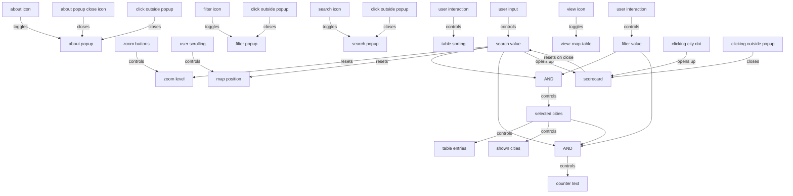

# Parking Mandates Map

This code runs the Mandates Map app for the Parking Reform Network: https://parkingreform.org/mandates-map/.

We do not use frameworks like React or Svelte to keep things simple. However, we do use these techniques:

- TypeScript
- Sass and the folder `src/css/theme`, which should stay aligned with https://github.com/ParkingReformNetwork/parking-lot-map
- Reactive state management - see [State diagram](#state-diagram)

The main files are `index.html`, `src/js/main.ts`, and `data/*.csv`. `main.ts` will load the CSV data to load all our data.

## Developing the map app

Prerequisites:

1. Install [Node Package Manager (npm)](https://nodejs.dev/en/download/).

_If you are using Windows OS, install [Windows Subsystem for Linux (WSL)](https://learn.microsoft.com/en-us/windows/wsl/install). Currently, there are 2 versions out. WSL 1 will run npm **way** faster<sup>[1](https://stackoverflow.com/questions/68972448/why-is-wsl-extremely-slow-when-compared-with-native-windows-npm-yarn-processing)</sup>. You can switch to version 1 with `wsl --set-version Ubuntu 1`. Run all npm commands in wsl/Ubuntu._

2. Run `npm i` in the main folder.

### Start the development server

```bash
❯ npm start
```

Then open http://127.0.0.1:1234 in a browser. Hit `CTRL-C` to stop the development server.

When the server is running, you can make any changes you want to the project. Reload the page in the browser to see those changes. (You may need to force reload, e.g. hold the shift key while reloading on macOS.)

### Check type compilation

We write our code in TypeScript. The types are ignored when starting the server and running tests, but it's useful to manually check for any errors caught by TypeScript:

```bash
❯ npm run check
```

### Run tests

```bash
❯ npm test
```

If the tests are taking a long time to start, run `rm -rf .parcel-cache` and try the tests again.

### Autoformat code

We use Prettier to nicely format code.

```bash
❯ npm run fmt
```

Before pushing code, run this command and commit the changes. Otherwise, PR checks will not pass.

### Lint code

"Linting" means using tools that check for common issues that may be bugs or low code quality.

```bash
❯ npm run lint
```

### Try out a build locally

You can preview what a build will look like by running `npm run build`. Then use `npm run serve-dist` to start the server. A 'build' are the files sent for production on the real site. This is slightly different from the development server run by `npm start`, which prioritizes a quick start for development.

`npm run test-dist` will be implemented soon, while `npm test` is the development equivalent.

## Staging

We use continuous deployment, meaning that we re-deploy the site every time we merge a pull request to staging at https://parkingreform.org/mandates-map-staging/. You can check how the site renders about ~1-2 minutes after your change merges.

## Deploy the site to prod

First, check that staging looks good at https://parkingreform.org/mandates-map-staging/.

Then, when ready, click "Run workflow" at https://github.com/ParkingReformNetwork/reform-map/actions/workflows/deploy-map-prod.yaml with the default option. Check that the deploy worked by confirming https://parkingreform.org/mandates-map/ looks good.

## Updating the data

You usually should not need to manually do this. We have a GitHub Action that runs every night to open a PR with any updates.

You can trigger the GitHub Action to run early by clicking "Run workflow" at https://github.com/ParkingReformNetwork/reform-map/actions/workflows/update-data.yaml with the default option, if you're an admin. This will create a pull request that you then need to merge.

To instead manually update the data, first run `npm install`. Then, run either:

- `npm run update-map-data`, or
- `npm run update-city-detail`.

### Update latitude and longitude

Update https://docs.google.com/spreadsheets/d/15L8hwNEi13Bov81EulgC8Xwt9_wCgofwcH49xHoNlKI/edit#gid=0. Our nightly cron job will open a PR to sync the updates.

## State diagram

This shows all possible user interactions on the map, and what triggers what.



We use reactive programming for state management. See https://github.com/ParkingReformNetwork/parking-lot-map/blob/main/README.md#state-diagram for an explanation.
